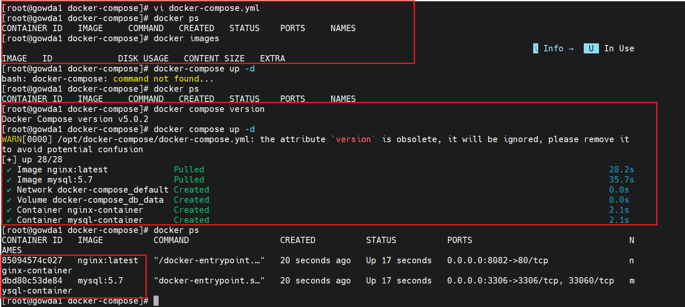

# Docker Compose: Nginx + MySQL

This project demonstrates a multi-container setup using Docker Compose with Nginx as a web server and MySQL as a backend database.

---

## Overview

- Nginx serves static content
- MySQL runs as a separate service
- Both containers run in the same Docker network (default)
- Persistent storage is configured for MySQL using volumes

---

## Architecture

Docker Compose creates a default network where all services can communicate using service names.

- Web container → connects to database using `db:3306`
- No manual network configuration required

---

## Prerequisites

Ensure Docker and Docker Compose are installed.

Check versions:

```bash
docker --version
docker compose version
```

> Note: If Docker Compose is not available, install or enable it as per your OS.


## Setup

```bash
docker-compose up -d
```

Verify:

```bash
docker ps
```

```



```
## Access

Application is available at:


http://localhost:8082

```


```

---

## Data Persistence

- MySQL data is stored using a named volume (`db_data`)
- Ensures data is retained across container restarts

---

## Static Content

Nginx serves content from:

```
./html → /usr/share/nginx/html
```

Any changes in `html/index.html` are reflected immediately.

```bash

## Commands

docker-compose up -d
docker-compose down
docker ps
```

---

## Notes

- Designed for local development and testing
- Can be extended with application services
- Easily scalable using Docker Compose
