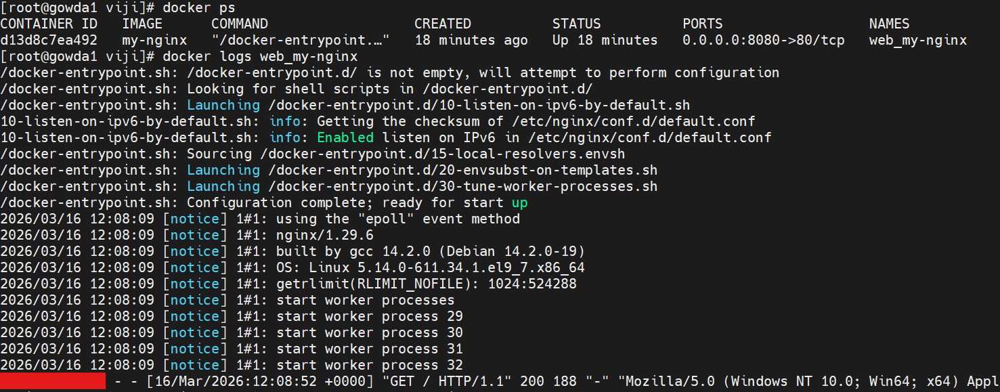
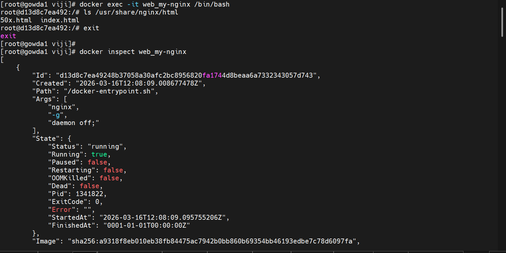
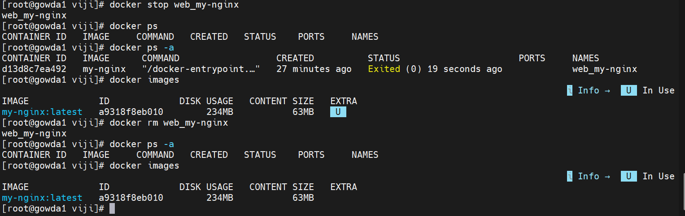

# Docker Container Troubleshooting

This document shows common Docker commands used for debugging and managing containers.

---

## View Container Logs

The `docker logs` command is used to view logs generated by a running or stopped container.  
It helps administrators troubleshoot application startup issues and monitor container activity.


docker logs web_my-nginx
docker logs -f web_my-nginx



Access Container & Inspect Configuration

The docker exec command allows users to enter a running container and execute commands inside it.
This is useful for checking files, logs, or running diagnostics inside the container.

The docker inspect command provides detailed JSON information about a container including network settings, mounts, environment variables, and configuration.

docker exec -it web_my-nginx /bin/bash
docker inspect web_my-nginx

 


Stop Running Container

The docker stop command gracefully stops a running container.
Docker sends a SIGTERM signal allowing the application to shut down properly.

docker stop web_my-nginx



```

Commands Summary
docker ps
docker logs web_my-nginx
docker exec -it web_my-nginx /bin/bash
docker inspect web_my-nginx
docker stop web_my-nginx
