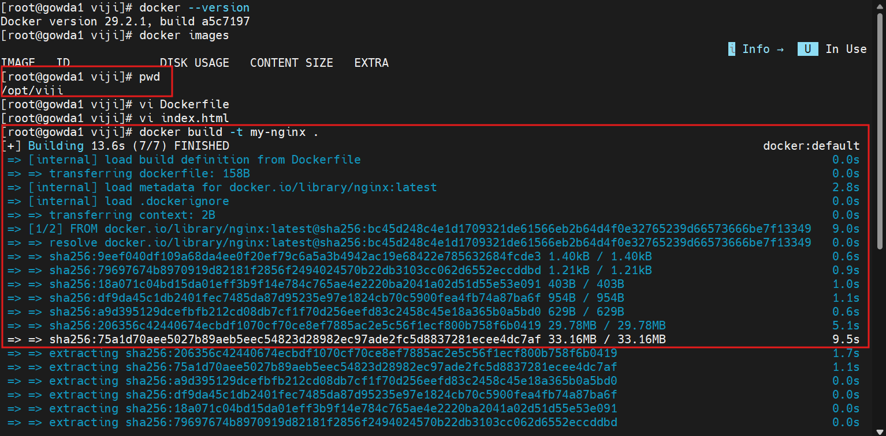
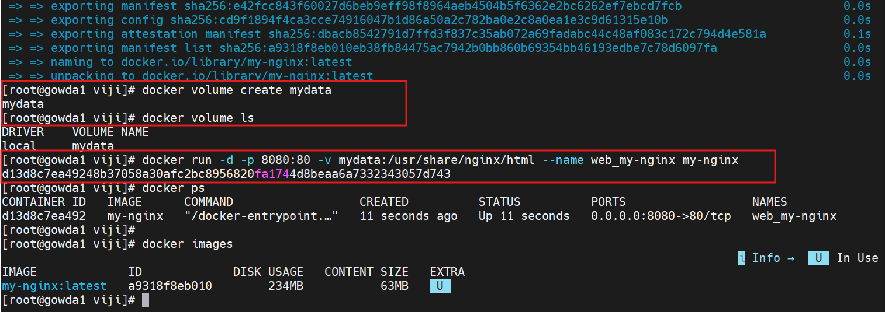
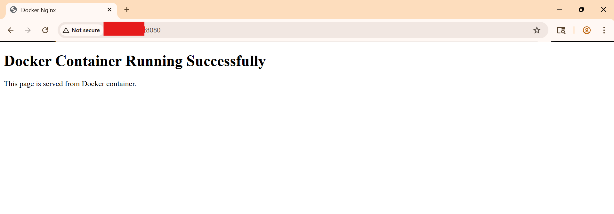

# Docker Nginx Container

This project demonstrates running an Nginx web server inside a Docker container using a custom Dockerfile.

---

## Dockerfile



---

## Docker Image Build



---

## Access Application



---

## Commands Used

```bash
docker build -t my-nginx .

docker run -d -p 8080:80 --name web_my-nginx my-nginx
