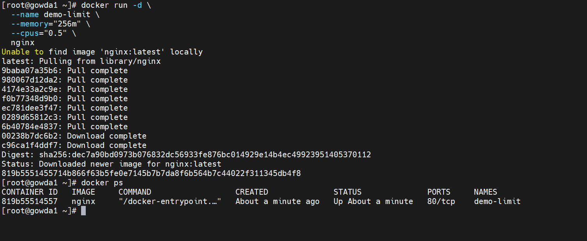
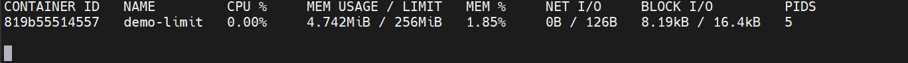
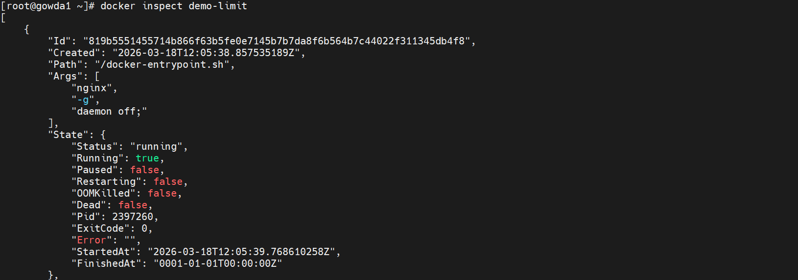
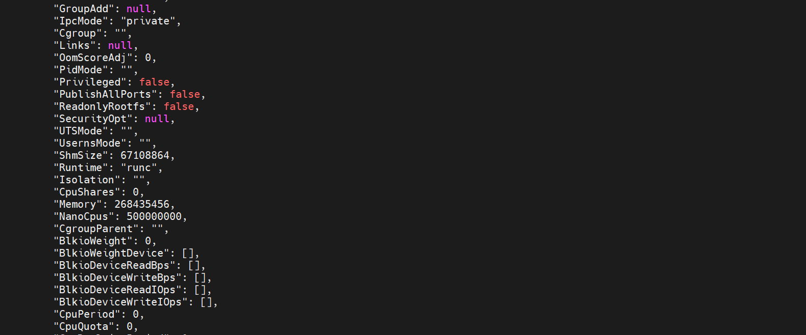

# Docker Resource Management (Production-Oriented)
This project demonstrates applying and validating CPU and memory limits on Docker containers to ensure stable performance and prevent resource exhaustion in multi-container environments.


----

**Real-Time Use Case**
```
Containers share the same host
Without limits → memory & CPU issues
Critical services may be impacted
Demonstrates controlled resource usage
```

# Implementation

**Run Container with Limits**

```
docker run -d \
  --name stress-test \
  --memory="256m" \
  --cpus="0.5" \
  progrium/stress --vm 1 --vm-bytes 300M
```


✔ Memory limited to 256MB
✔ CPU limited to 0.5 core
✔ Stress tool used to simulate load

# Monitoring & Validation

**Check Running Container**
```
docker ps
```



**Monitor Resource Usage**
```
docker stats
```
 

**Inspect Resource Limits**

 

 


**Inspect Resource Limits (Optional)**
```
docker inspect stress-test
```


**This command provides detailed**
```
Memory limits

CPU allocation

Runtime settings
```
